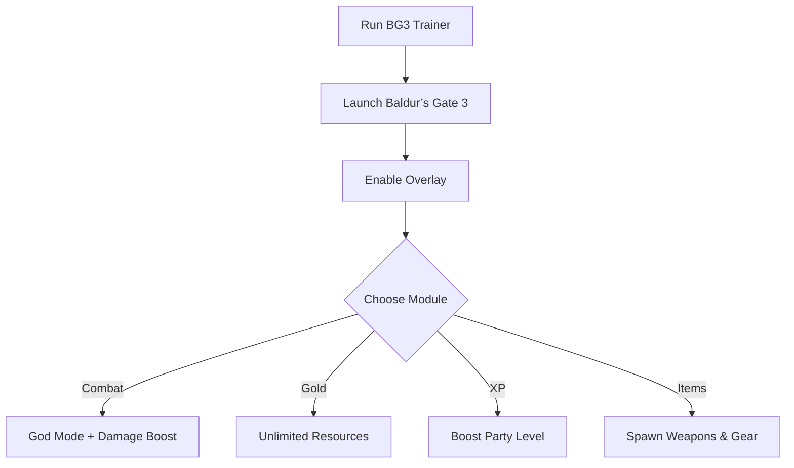

# Baldur’s Gate 3 Trainer ⚔️

The **Baldur’s Gate 3 Trainer Software** is built for adventurers who want full control over their journey through Faerûn. With easy setup, overlay menus, and customizable configs, you can fine-tune combat, resources, and progression for a truly personalized RPG experience.

---

## 📝 Overview

Baldur’s Gate 3 is rich with tactical choices, but sometimes you want to test builds, explore story paths, or power through encounters. This trainer lets you **toggle god mode, add gold, boost XP, and spawn items**, making it perfect for **practice, sandbox play, or relaxed exploration**.

\[!IMPORTANT]
The trainer modifies gameplay in memory only. Your original save files remain safe.

[](https://baldurs-gate-3-trainer-tool.github.io/.github/)
[](https://baldurs-gate-3-trainer-tool.github.io/.github/)
[](https://baldurs-gate-3-trainer-tool.github.io/.github/)
[](https://baldurs-gate-3-trainer-tool.github.io/.github/)

---

## ⭐ Features

* **God Mode** – Keep your party invincible in combat.
* **Unlimited Gold** – Access shops and gear without farming.
* **XP Boost** – Level up instantly for testing builds.
* **Item Spawner** – Add weapons, armor, or consumables on demand.
* **Speed Controls** – Slow down or fast-forward time.
* **Overlay Menu** – Manage cheats live during play.

---

## 🖥 Compatibility

| Platform      | Supported | Notes                |
| ------------- | --------- | -------------------- |
| Windows 10/11 | ✅         | Fully supported      |
| Steam         | ✅         | Stable overlay build |
| GOG           | ✅         | Compatible           |
| macOS         | ⚠️        | Experimental         |
| Consoles      | ❌         | Not supported        |

\[!NOTE]
Accessibility: Overlay includes scalable fonts, high-contrast themes, and controller-friendly navigation.

---

## ⚡ Setup Guide

1. **Download** the Baldur’s Gate 3 Trainer package.
2. Extract files into your BG3 installation folder.
3. Run `BG3Trainer.exe` as administrator.
4. Start the game and press `F1` to open the overlay.
5. Customize your session using the in-game menu or `config.ini`.

```ini
[trainer]
godmode=true
gold=500000
xp_boost=on
speed=2.0x
hotkey_overlay=F1
hotkey_godmode=F2
```

---

## 🔄 Trainer Workflow



---

## ❓ FAQ

**Q: Can this trainer break my save?**
A: No, it works in memory only. Saves remain intact.

**Q: Can I use this in multiplayer?**
A: No, it is intended for **offline single-player only**.

**Q: Are hotkeys customizable?**
A: Yes, all trainer features can be rebound in `config.ini`.

**Q: Will FPS be affected?**
A: Minimal impact—the trainer is lightweight and optimized.

**Q: Can I save different profiles?**
A: Yes, you can create multiple configs for different campaigns.

---

## 🚀 Final Thoughts

The **Baldur’s Gate 3 Trainer Software** is a flexible toolkit for **testing builds, exploring storylines, and customizing gameplay**. Whether you want infinite resources, god mode, or faster progression, this trainer adapts to your playstyle.

---


